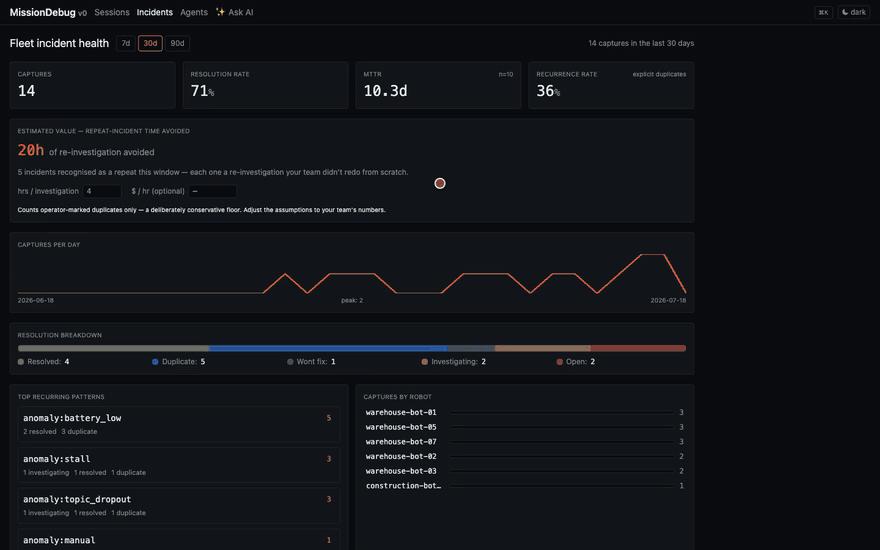

# MissionDebug demos

> Try [MissionDebug](https://github.com/mukul-07/missiondebug) in 60 seconds. No ROS install, no source checkout.

**MissionDebug is the incident memory for your robot fleet.** It captures the 60 seconds around every failure, then makes that history *queryable* — so your team stops re-solving the same incident over and over. This repo runs a self-contained demo, pre-loaded with a realistic fleet incident history, so you can see the dashboard your ops team actually buys — and scrub a real capture in the browser.


[](docs/demo.mp4)

> **🎬 Click the preview** (or open [docs/demo.mp4](docs/demo.mp4)) for the full 60-second tour.

> **Showing this to someone?** [`docs/DEMO-SCRIPT.md`](docs/DEMO-SCRIPT.md) is a repeatable 5-minute walkthrough — lead with the dashboard, make the ROI tile show their own number, then drill into one recurring incident.

> **💳 Pricing & plans:** the single-robot capture + replay + incident dashboard is **free (MIT)** — run it forever. **[Fleet & Enterprise plans →](https://mukul-07.github.io/missiondebug-demos/commercial.html)** add the central hub at scale, alerting (Slack/PagerDuty), retention/lifecycle, and the managed AI agent.

## Run it

You need [Docker](https://docs.docker.com/get-docker/) with Compose.

```bash
git clone https://github.com/mukul-07/missiondebug-demos.git
cd missiondebug-demos
docker compose up
```

Open <http://localhost:8000>, then click **Incidents** in the top nav.

First run pulls a pre-built image from [GHCR](https://github.com/mukul-07/missiondebug/pkgs/container/missiondebug) (~30 seconds, multi-arch — works on amd64 and arm64). A one-shot `seed` job then populates the hub with a sample fleet incident history (it exits when done; the main service keeps running). Subsequent runs are instant.

> If `docker compose` complains about permissions, prefix with `sudo` or add your user to the `docker` group: `sudo usermod -aG docker $USER && newgrp docker`.

## What you'll see

### 🟢 The fleet incident dashboard — `Incidents` in the top nav

This is the surface a fleet-ops lead buys. The demo seeds 9 incidents across 5 robots so the dashboard renders for real:

- **MTTR** (mean time to resolution) and **resolution rate** across the fleet.
- **Recurrence rate** — how many captures are duplicates of incidents you've already seen. The hook: *"this exact failure already happened twice, and here's the fix."*
- **Top recurring patterns** by failure mode (`battery_low`, `topic_dropout`, `stall`, `path_deviation`), with a per-status breakdown.
- **Captures per day** sparkline and **captures by robot** bars.
- A **window switcher** (7d / 30d / 90d).

Switch to **30d** to see the full seeded history.

### "Has this happened before?" — open any incident

Open **`SES-203`** (a `battery_low` capture on `warehouse-bot-03`). At the top of the detail page:

- A **structured summary** of what was captured (rule, robot, subsystem, topics, payload) — generated deterministically at capture time, no LLM, works fully offline.
- **"Has this happened before?"** surfaces the most similar past incidents — `SES-201` and `SES-202`, both already **resolved**, with their **root causes shown inline** ("Battery pack cell 3 degraded…"). That's the loop that saves your team a re-investigation.
- A **resolution panel** — status (open / investigating / resolved / duplicate / won't-fix), root cause, linked ticket. Edits roll straight into the dashboard's MTTR and recurrence numbers.

> Seeded incidents carry their *metadata* but not the raw recording, so their detail page shows a clean **"recording unavailable"** state — that's intentional: at fleet scale the incident memory outlives the raw clip (retention tiers it to cold storage). To see full replay, open a fixture below.

### 📼 Scrub a capture — real construction-robot footage + a 30-topic fleet robot

The demo ships two MCAP fixtures so you can see the replay layer:

**`construction_indoor_60s` — real robot, real site.** A 60-second cut from a real construction robot driving an indoor site: front camera and a colorized depth camera side by side at 10 Hz, two odometry sources, and two IMUs at native rates (100/200 Hz). The robot covers ~50 m during the clip — concrete pillars, stacked panels, a power trowel in frame. (Distant workers visible through the open building edge are blurred for privacy, and GPS topics are stripped from the cut.)

**`warehouse_robot_30_topics` — the fleet-scale view.** 30 synthetic topics in the shape of a real fleet robot — diagnostics, control feedback, state machines, multi-field hardware, two `cmd_vel`-shaped control topics. Demonstrates how the UI scales to a real 30-topic robot.

On either fixture you can:
- Scrub the timeline, hit **space** to play, `←` / `→` for 100ms steps, `Shift+←` / `Shift+→` for 1s.
- **Add an annotation at the playhead** and **copy a deep-linked URL** (`?t=14.2`) to share an exact frame.
- Open the **command palette** (`⌘K` / `Ctrl+K`) to jump between sessions / robots / subsystems.
- On the 30-topic session, the **scalar chart grid** auto-renders one chart per numeric topic — filter it with the **chip-based filter** (`?q=imu,motor`).
- Use the **JSON inspector** to scrub the decoded message tree for any topic.
- **`Open in Foxglove`** hands the same MCAP to Foxglove Studio for 3D / custom layouts.

The **`Fleet`** view (top nav) shows agent health — online / stale / silent — across the seeded robots.

## What this demo is, and isn't

**It is** the hub: the fleet incident dashboard, per-incident similarity + resolution, and the replay UI — backend + web, pre-seeded with a sample incident history, a real construction-robot capture, and a synthetic 30-topic fixture.

**It isn't** the capture layer. The agent that subscribes to ROS topics and writes a new session when a detector fires only runs on a real ROS 2 system. For that, install the `.deb`s on your robot — see [the main repo](https://github.com/mukul-07/missiondebug#install-on-a-real-robot). Once an agent reports to this hub, *its* captures populate the same dashboard.

## How it fits together

| | What it does | Where it runs |
|---|---|---|
| **Agent** | Subscribes to ROS topics, keeps a 60s rolling buffer, writes MCAP + a structured summary when a detector fires, reports to the hub | Real robot only (rclpy) |
| **Hub (backend)** | Stores incidents, rolls up the fleet dashboard, runs similarity search, serves API + UI | Anywhere (this demo) |
| **Web UI** | The incident dashboard + per-incident replay (Foxglove libraries) | Browser, served by backend |

## Adding your own fixture

Drop any MCAP file into `fixtures/` and restart the container. The backend will index it and surface it in the session list.

```bash
cp /path/to/your.mcap fixtures/
docker compose restart
```

## Demonstrating fleet auth (v2 P4)

By default the demo runs in `single` mode (open routes). To show the fleet-tier auth gate, set a password before starting — the seed job uses the same secret as its Bearer token automatically:

```bash
export MD_MODE=fleet
export MD_HUB_AUTH_PASSWORD=demo
docker compose up -d --force-recreate
```

## Demonstrating OpenTelemetry → Grafana

MissionDebug can export its incidents + KPIs to your existing observability
stack over OpenTelemetry, so they show up where your team already looks —
no separate tab. This overlay shows it live with a self-contained
Prometheus + Grafana:

```bash
docker compose -f docker-compose.yml -f docker-compose.otel.yml up
```

Then:
1. Open the app, click **Incidents**, and seed/capture some incidents
   (`./scripts/seed-incidents.sh`, or trigger a capture).
2. Open **Grafana → http://localhost:3000** (anonymous, no login) and the
   **"MissionDebug — Fleet Incidents"** dashboard. Within ~15s the panels
   populate: captured/resolved counts, recurrence rate, MTTR, agents
   reporting — the same KPIs as the in-app dashboard, now in *your* Grafana.

The hub (not the robot) pushes OTLP to Prometheus on the compose network —
nothing leaves the host, works air-gapped. In production you'd point
`MD_OTEL_ENDPOINT` at your own collector and route the incident events to
Slack / PagerDuty; see the main repo's `docs/INTEGRATIONS.md`.

> If a Grafana panel shows "No data", Prometheus may translate the OTLP
> metric names slightly differently across versions. Check the exact names
> at <http://localhost:9090> (search `missiondebug`) and adjust the panel
> queries — the metrics are flowing as soon as they appear there.

## Ask AI — plain-English Q&A (bring your own key)

The Incidents dashboard has an **"Ask AI"** panel: ask your incident history
in plain English and get a grounded answer that cites the exact incidents it
used.

**This is the only feature that needs an LLM key — everything else in this
demo (the dashboard, similarity, replay, resolutions) works with zero setup.**
It's opt-in and **bring-your-own**: your key and your data stay on your host —
nothing goes to a MissionDebug cloud (air-gap-friendly). Add your own
**OpenAI or Anthropic** key to turn it on:

```bash
cp .env.example .env          # then set MD_LLM_API_KEY=...
#   OpenAI:    MD_LLM_API_KEY=sk-proj-...   (or sk-...)
#   Anthropic: MD_LLM_API_KEY=sk-ant-...
# The provider is auto-detected from the key prefix; default model is cheap
# (gpt-4o-mini / claude). A few demo questions cost cents.
docker compose up -d --force-recreate
```

Open the **Incidents** tab and try: *"Has the battery_low issue happened
before, and what fixed it?"* — it answers from the seeded corpus and links to
the cited sessions. Without a key, the panel shows a calm "add your key" note
(nothing breaks). Air-gapped? Point `MD_LLM_BASE_URL` at a local /
OpenAI-compatible model (Ollama, vLLM, …) instead of the cloud. Only incident
*metadata* is ever sent to the LLM — never recordings or PII.

## Pinning to a specific version

By default the demo tracks `:latest` (tip of `main`). To pin to a release tag or a specific commit, edit `docker-compose.yml`:

```yaml
services:
  missiondebug:
    image: ghcr.io/mukul-07/missiondebug:1.5.0   # release tag
    # or:
    # image: ghcr.io/mukul-07/missiondebug:sha-abc1234   # immutable commit ref
```

Browse available tags: <https://github.com/mukul-07/missiondebug/pkgs/container/missiondebug>.

## Build from source (offline / airgap)

If you can't reach GHCR, build the image yourself from the main repo:

```bash
git clone https://github.com/mukul-07/missiondebug.git
cd missiondebug
docker build -t ghcr.io/mukul-07/missiondebug:latest .
```

Then `cd` back to this demos repo and `docker compose up` — compose will use the locally-built image you just tagged.

## Cleanup

```bash
docker compose down                                         # stop the containers
rm -rf sessions/                                            # remove indexed data
docker image rm ghcr.io/mukul-07/missiondebug:latest        # remove the pulled image
```

To start from a clean hub and re-seed, `rm -rf sessions/` then `docker compose up` again — the seed job re-populates it.

## Common issues

**The Incidents dashboard is empty.** The one-shot `seed` job may still be waiting for the backend, or it errored. Check its log:

```bash
docker compose logs seed
```

It prints one `HTTP 200` line per seeded incident. Re-run it on its own with `docker compose up seed`.

**Port 8000 already in use on the host.** Override via a `.env` file (works under sudo, which strips inline env vars):

```bash
cp .env.example .env             # then uncomment HOST_PORT=8080
docker compose down              # tear down any stale container
docker compose up -d --force-recreate
```

Then open <http://localhost:8080>.

**Reached a Linux VM from a different machine.** `localhost` from the host won't reach the container — you need the VM's IP:

```bash
# inside the VM
hostname -I
# → e.g. 192.168.64.7
```

Open `http://<vm-ip>:8080` from your host browser.

**`docker ps` shows the container running but no port in the PORTS column.** Compose reused a stale container created with old config. Force a rebuild:

```bash
docker compose down
docker compose up -d --force-recreate
```

**Container exits when you close the terminal.** Run detached so it survives:

```bash
docker compose up -d             # -d = detached
docker compose logs -f           # tail logs in another terminal
```

## License & pricing

This demo repo is MIT. The MissionDebug **product** is **open-core** — the free Community tier is MIT (run it forever, commercially included); the paid **Fleet / Enterprise** features are proprietary. See **[plans & pricing →](https://mukul-07.github.io/missiondebug-demos/commercial.html)** and the main repo's [LICENSING.md](https://github.com/mukul-07/missiondebug/blob/main/LICENSING.md).
